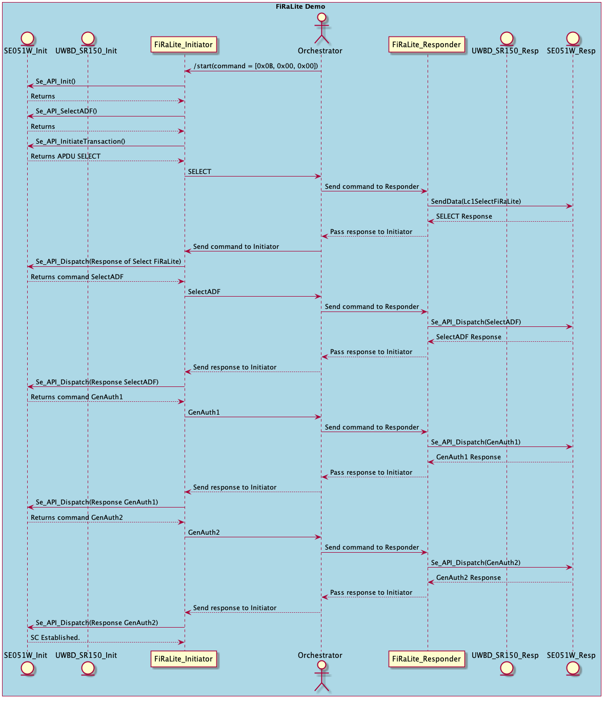
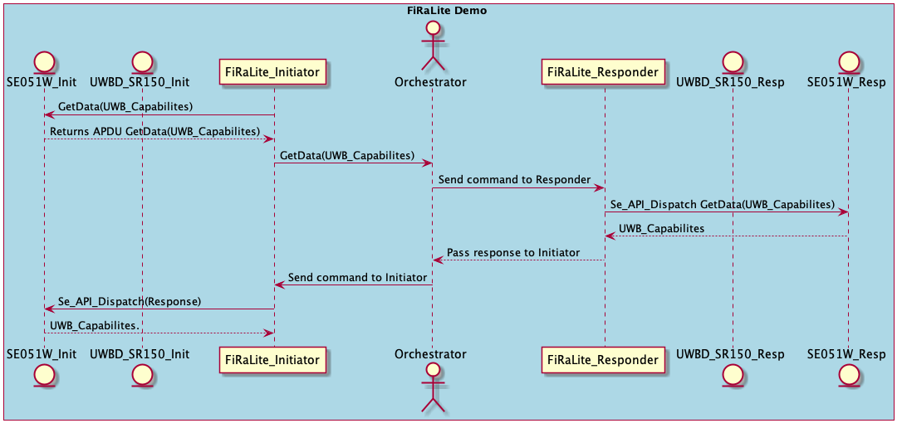
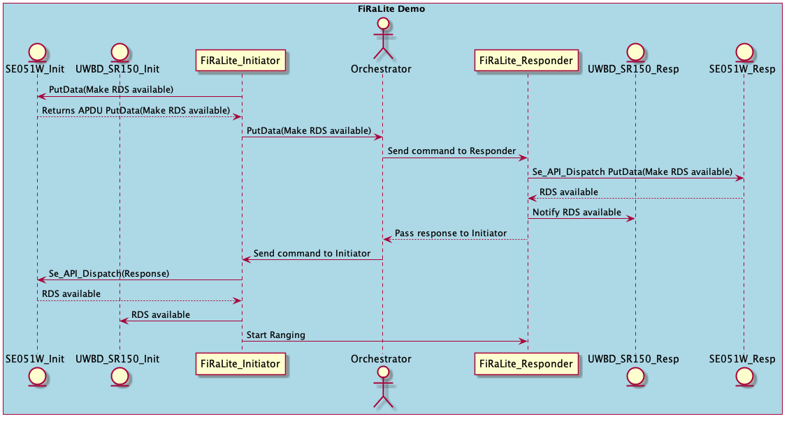

..
    Copyright 2021 NXP

    This software is owned or controlled by NXP and may only be used
    strictly in accordance with the applicable license terms.  By expressly
    accepting such terms or by downloading, installing, activating and/or
    otherwise using the software, you are agreeing that you have read, and
    that you agree to comply with and are bound by, such license terms.  If
    you do not agree to be bound by the applicable license terms, then you
    may not retain, install, activate or otherwise use the software.

.. _demo-firalite-initiator:

=======================================================================
 SR150 FiraLite Initiator
=======================================================================

.. brief:start

This demo showcases secure ranging between two SR150-Se051W board, using FiraLite applet.
This demo will configure the device as a Initiator-Controller.

In case of RTOS based platform with USB or UART, communication between initiator and
responder is handled using serial communication via PC, and python application listening
on UART com ports.
And in case of embed linux hosts communication between initiator and responder is handled
over IP, using socket, with initiator and responder devices as clients,
and a python server running on a PC in the same network.

.. brief:end

Following sequence of steps are handled.

- Initialize UWBD in Mainline Firmware.
- Authenticate with responder device using FiraLite applet
- Get the capabilities of the responder device
- Get the wrapped ranging data set using FiraLite applet
- Set the application ranging parameters
- Perform secure ranging with dynamic STS.

Secure Ranging on SR150-SE051W with FiRaLite Applet
^^^^^^^^^^^^^^^^^^^^^^^^^^^^^^^^^^^^^^^^^^^^^^^^^^^^^^^^^^^^^^^^^^^^^^^

- Following is the TLV coding followed for communication between initiator and responder.
- Tag is 1 byte coding Length is 2 bytes.

TAG ::

    SE_SELECT_APPLET  0x78
    SE_DISPATCH       0x79
    SE_TUNNEL_GETDATA 0x7A
    SE_TUNNEL_PUTDATA 0x7B
    SE_START_RANGING  0x7C

- Once the Python Orchestrator starts TLV_TYPE_START 0x0B,0x00,0x00 is sent to initiator to
  start the channel initialization.
- The end of communication once wrapped RDS is available is sent by initiator to python orchestrator
  with TLV_START_RANGING ``7C 00 00`` and then from Orchestrator to responder, and Ranging procedure is started on both sides.

FiRaLite Applet Version
^^^^^^^^^^^^^^^^^^^^^^^^^^^^^^^^^^^^^^^^^^^^^^^^^^^^^^^^^^^^^^^^^^^^^^^
The demo is modified for FiRaLite(R4) 1.0.9 Release which available with
On OEF A739 Run3 with FiRaLite updated to latest applet.
Or on OEF A739 Run5 (already has latest FiRalite).
There is no hybrid testing permitted.
Mean both on the initiator and responsder should be on same latest FiRaLite versions.
The demo has changes for Remote get data tag as per FiRa Consortium.

Prerequisites
^^^^^^^^^^^^^^^^^^^^^^^^^^^^^^^^^^^^^^^^^^^^^^^^^^^^^^^^^^^^^^^^^^^^^^^
- SE051W should be connceted to host Refer :numref:`board-se051w` :ref:`board-se051w`
- SR150 should be bound to SE051W. Refer :numref:`sr150-demo-binding` :ref:`sr150-demo-binding`
- Perform the ADF provisioning Refer :ref:`firalite-adf-provisioning`
- Once ADF provisioning sucessful we can run ``demo_fl_initator`` binary.

How to Build
^^^^^^^^^^^^^^^^^^^^^^^^^^^^^^^^^^^^^^^^^^^^^^^^^^^^^^^^^^^^^^^^^^^^^^^
- For RTOS based platform refer :numref:`rhodesv4se-McuXpresso-project` :ref:`rhodesv4se-McuXpresso-project`
- For embed linux platform refer :numref:`build-rpi-mk-shield` :ref:`build-rpi-mk-shield`

- Source:   ``demo_fl_initiator``

Steps to be followed to run from RTOS-embedded device:
^^^^^^^^^^^^^^^^^^^^^^^^^^^^^^^^^^^^^^^^^^^^^^^^^^^^^^^^^^^^^^^^^^^^^^^

1) Flash ``demo_fl_initiator.bin`` file to the device
#) Flash ``demo demo_fl_responder.bin`` file to 2nd device
#) Get the comport of both initiator and responder device from device manager.
#) Connect to the com ports using any terminal application like putty/teraterm and reset both the device

#) On initiator port check the following log::

    APP     :INFO :Initiator Starting OOB Session

#) On responder port check the following log::

    APP     :INFO :responder Starting OOB Session

#) If these logs are not seen reset the device
#) Disconnect the com ports from terminal application
#) Run the python script in command prompt present at demos/SR150/fira_lite/ as::

    python fira_lite_serial_transport.py <Initiator-COM-Port> <Responder-COM-Port>

Steps to be followed to run from linux host like Rpi
^^^^^^^^^^^^^^^^^^^^^^^^^^^^^^^^^^^^^^^^^^^^^^^^^^^^^^^^^^^^^^^^^^^^^^^

1) Two linux host devices should be connected in same network.
2) Run the python script from a pc connceted in same network present at demos/SR150/fira_lite/ as::
    python fira_lite_socket_transport.py
3) you will see the log with your ip address ::

    server started 192.168.29.75 Waiting for client on port 8080

4) Build the demo demo_fl_initiator on one host linux device.
#) Set the environment variable UWBIOT_ENV_COM with the server ip address and run the demo::

    export UWBIOT_ENV_COM=192.168.29.75:8080
    ./demo_fl_initiator

#) Build the demo demo_fl_responder on other host linux device, and follow the previous step.

Log (Success)
^^^^^^^^^^^^^^^^^^^^^^^^^^^^^^^^^^^^^^^^^^^^^^^^^^^^^^^^^^^^^^^^^^^^^^^

Once the authentication and storing wrapped RDS is done, python script will end with following log::

    InitiatorRX:  79 00 25 0c db 3f ff 20 c3 68 41 89 86 42 87 29 9b fe f6 2e 6c 88 88 6a 6c eb fe 74 81 3e 5a 58 55 92 ce df 87 2b ce 40

    ResponderRX:  79 00 12 2a 2a ba c5 07 3e 2d 7f 9f 69 84 99 36 38 c7 23 90 00

    InitiatorRX:  7c 00 00
    Initialisation completed start ranging
    FiraLite transport done

After this, reconnect to both the com ports using any terminal application like putty/teraterm,
to see the ranging notifications, nothing needs to be done for linux host devices.
Ranging is done for 5 mins and then session is closed.

At the end of program execution, log message like this must be seen::

    TMLUWB  :RX < :RECV        :6200003D 38010000 44332211 ... 00
    TMLUWB  :RX < :RECV        :6200003D 39010000 44332211 ... 00
    TMLUWB  :TX > :SEND        :22010004 44332211
    TMLUWB  :RX < :RECV        :60070001 0A
    TMLUWB  :TX > :SEND        :22010004 44332211
    TMLUWB  :RX < :RECV        :42010001 00
    TMLUWB  :RX < :RECV        :61020006 44332211 0300
    TMLUWB  :TX > :SEND        :21010004 44332211
    TMLUWB  :RX < :RECV        :60010001 01
    TMLUWB  :RX < :RECV        :41010001 00
    TMLUWB  :RX < :RECV        :61020006 44332211 0100
    APP     :INFO :Finished D:/UWB_Iot_WorkArea/UWB_Iot_Top_SR150/uwbiot-top/demos/SR150/demo_fl_initiator/demo_fl_initiator.c : Success

If such a log is not seen, re-run the steps .
