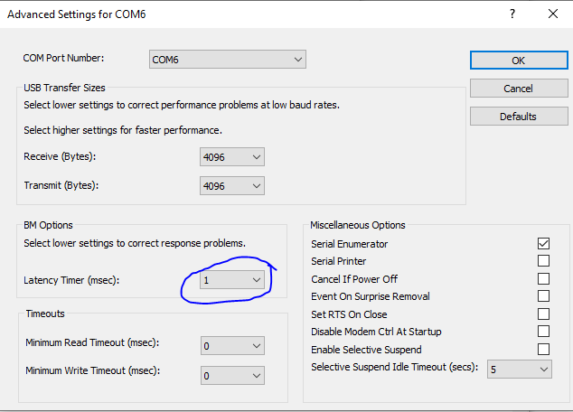

..
    Copyright 2021 NXP

    This software is owned or controlled by NXP and may only be used
    strictly in accordance with the applicable license terms.  By expressly
    accepting such terms or by downloading, installing, activating and/or
    otherwise using the software, you are agreeing that you have read, and
    that you agree to comply with and are bound by, such license terms.  If
    you do not agree to be bound by the applicable license terms, then you
    may not retain, install, activate or otherwise use the software.

.. _demos-vcom:

=======================================================================
 se_vcom
=======================================================================

.. brief:start

This project allows the Rhodes4 boards to be used as a
bridge between the PC and the secure module and enables the execution of the
config tool and other utilities from the PC

.. brief:end

How to Build
^^^^^^^^^^^^^^^^^^^^^^^^^^^^^^^^^^^^^^^^^^^^^^^^^^^^^^^^^^^^^^^^^^^^^^^

Build the project for SR150 Using MCUXpresso IDE Project :

- Source:   ``se_vcom``

How to Run
^^^^^^^^^^^^^^^^^^^^^^^^^^^^^^^^^^^^^^^^^^^^^^^^^^^^^^^^^^^^^^^^^^^^^^^
The project ``se_vcom`` has package compiled for Rhodes4 board located at
:file:`binaries/Rhodes4_SE/`
in the project and can be run for SE051W natively as::

    se_vcom.bin

.. note:: In device manager change your COMPORT settings.
    By default latency timer(msec) is set as 16mesc update it to 1msec.
    ``COM port properties → port settings → advanced → latency timer(msec)``

