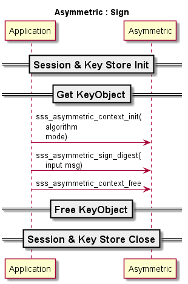
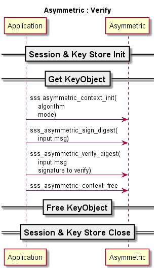
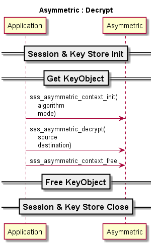

..
    Copyright 2019,2020 NXP

    This software is owned or controlled by NXP and may only be used
    strictly in accordance with the applicable license terms.  By expressly
    accepting such terms or by downloading, installing, activating and/or
    otherwise using the software, you are agreeing that you have read, and
    that you agree to comply with and are bound by, such license terms.  If
    you do not agree to be bound by the applicable license terms, then you
    may not retain, install, activate or otherwise use the software.

======================================================================
 Asymmetric
======================================================================

Sign
======================================================================

To perform sign operation , the sequence of APIs looks as under.

.. note ::
  1) To perform rsa sign and verify on plain data (with hash calculated inside SE), use sss_se05x_asymmetric_sign and sss_se05x_asymmetric_verify apis.

  #) Sign / Verify operations with Twisted Edward curve is supported only on plain data with hash calculated inside SE. Use sss_se05x_asymmetric_sign and sss_se05x_asymmetric_verify apis. Only SHA512 is supported.

Verify
======================================================================

To perform sign verify operation , the sequence of APIs looks as under:

Encryption
======================================================================

To encrypt the data  , the API sequence is as under:

Decryption
======================================================================

To Decrypt the encrypted data  , the API sequence is as under:

Reference Example
======================================================================

Before we use any Cryptographic operations, we need relevent Keys
to be declared.

Here is a reference snippet to *inject* a key into the Secure Domain.
(If the key was already existing in the Key Store, these steps are
not needed)

.. literalinclude:: ../ex/ecc/ex_sss_ecc.c
   :language: c
   :start-after: /* doc:start ex_sss_asymmetric-allocate-key */
   :end-before: /* doc:end ex_sss_asymmetric-allocate-key */

Signing on a :samp:`digest` of length :samp:`digestLen` is performed
as below.

.. literalinclude:: ../ex/ecc/ex_sss_ecc.c
   :language: c
   :start-after: /* doc:start ex_sss_asymmetric-asym-sign */
   :end-before: /* doc:end ex_sss_asymmetric-asym-sign */

After the above operation, :samp:`signature` has the signature using
the key object :samp:`keyPair`.

RSA Encryption algorithms supported
======================================================================

Supported rsa encyption / decryption algotithms - ``PKCS1_OAEP`` and ``PKCS1_V1_5``.

.. literalinclude:: ../inc/fsl_sss_api.h
   :language: c
   :start-after: /* doc:start rsa_enc_algo */
   :end-before: /* doc:end rsa_enc_algo */

RSA Signature algorithms supported
======================================================================

Supported rsa sign / verify algotithms - ``PKCS1_PSS_MGF1`` , ``PKCS1_V1_5`` and ``No_Padding``.

Hash algorithms supported for sign/verify - ``SHA1, SHA224, SHA256, SHA384, SHA512``

.. literalinclude:: ../inc/fsl_sss_api.h
   :language: c
   :start-after: /* doc:start rsa_sign_algo */
   :end-before: /* doc:end rsa_sign_algo */

.. literalinclude:: ../inc/fsl_sss_api.h
   :language: c
   :start-after: /* doc:start rsa_sign_algo_no_padding */
   :end-before: /* doc:end rsa_sign_algo_no_padding */

When using ``PKCS1_PSS_MGF1`` padding, there are few limitations on hash algorithm with rsa key size as below,

.. list-table::
    :widths: 20 50
    :header-rows: 1

    * - RSA Bit Length

      - Valid Hash Algorithm

    * - 512

      - SHA1, SHA224

    * - 1024

      - SHA1, SHA224, SHA256, SHA384

    * - 1152

      - SHA1, SHA224, SHA256, SHA384, SHA512

    * - 2048

      - SHA1, SHA224, SHA256, SHA384, SHA512

    * - 3072

      - SHA1, SHA224, SHA256, SHA384, SHA512

    * - 4096

      - SHA1, SHA224, SHA256, SHA384, SHA512

ECC Signature algorithms supported
======================================================================

Supported hash values for ecc sign / verify - ``SHA1, SHA224, SHA256, SHA384, SHA512``

.. literalinclude:: ../inc/fsl_sss_api.h
   :language: c
   :start-after: /* doc:start ecc_sign_algo */
   :end-before: /* doc:end ecc_sign_algo */

OR

.. literalinclude:: ../inc/fsl_sss_api.h
   :language: c
   :start-after: /* doc:start hash_algo */
   :end-before: /* doc:end hash_algo */

ECDAA algorithm

.. literalinclude:: ../inc/fsl_sss_api.h
   :language: c
   :start-after: /* doc:start ecc_bn_sign_algo */
   :end-before: /* doc:end ecc_bn_sign_algo */

APIs
======================================================================

See :ref:`api-ref-sss_crypto_asymmetric`
