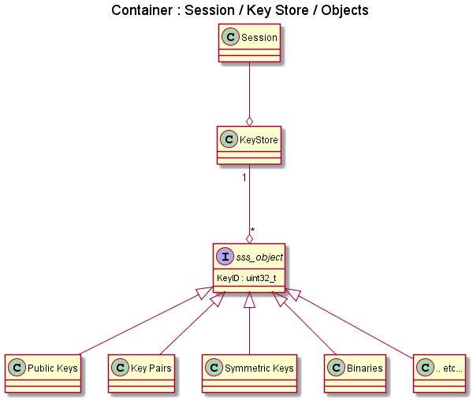
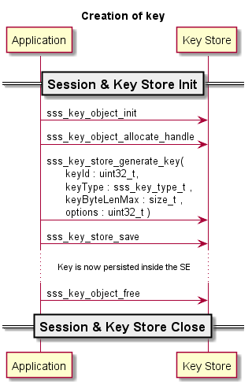
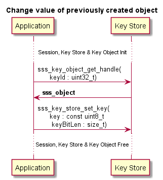
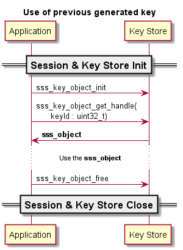

..
    Copyright 2019,2020 NXP

    This software is owned or controlled by NXP and may only be used
    strictly in accordance with the applicable license terms.  By expressly
    accepting such terms or by downloading, installing, activating and/or
    otherwise using the software, you are agreeing that you have read, and
    that you agree to comply with and are bound by, such license terms.  If
    you do not agree to be bound by the applicable license terms, then you
    may not retain, install, activate or otherwise use the software.

======================================================================
 Key Object
======================================================================

Objects / Key Objects are Low level entities of key/certificates in SSS domain.

Below we can see UML Hierarchy of an object:

Create / Provision
======================================================================

To create a key, the sequence of APIs looks as under.  This is generally
done during provisioning stage.

To set (inject) values in a previously allocated key, the sequence of APDUs look as under.

.. note:: Policies

    This section would be updated later to show case creation of keys with
    different policies attached to it.

Change value of previously created Objects
======================================================================

To create a key, the sequence of APIs looks as under:

Use previously provisioned/created Keys/Objects
======================================================================

To use a key, the API sequence is as under:

APIs
======================================================================

See :ref:`api-ref-sss_key_object`
