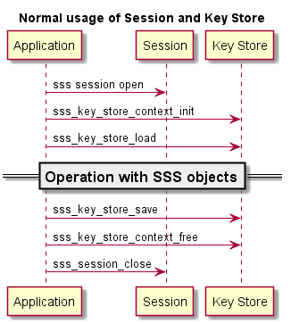

..
    Copyright 2019 NXP

    This software is owned or controlled by NXP and may only be used
    strictly in accordance with the applicable license terms.  By expressly
    accepting such terms or by downloading, installing, activating and/or
    otherwise using the software, you are agreeing that you have read, and
    that you agree to comply with and are bound by, such license terms.  If
    you do not agree to be bound by the applicable license terms, then you
    may not retain, install, activate or otherwise use the software.

======================================================================
 Key Store
======================================================================

KeyStore is a container for all secure keys and objects inside
a secure storage.

APIs
======================================================================

See :ref:`api-ref-sss_key_store`

Key Format
======================================================================

The ``sss_key_store_set_key`` and ``sss_key_store_get_key`` API's do not impose a specific
format on the data parameter. Different implementations of the SSS API can have different
capabilities in dealing with an input format (relevant for ``sss_key_store_set_key``) and will use
a specific output format (relevant for ``sss_key_store_get_key``). The following section illustrates this by
taking the example of the SE050 implementation in the context of EC Key pairs.

EC Key pair
............

When passing an EC key pair as data argument to the ``sss_key_store_set_key`` API, the key pair data must be DER encoded 
using either the pkcs#8 format or classic OpenSSL format.

When retrieving an EC key pair as data argument from the ``sss_key_store_get`` API, the full key pair cannot be retrieved.
Instead the public key value is returned. The public key is retrieved in ANSI X9.62 uncompressed format.