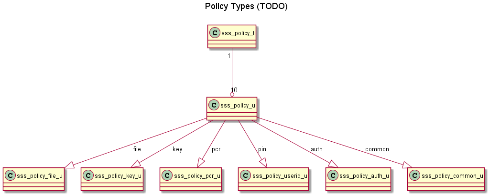

..
    Copyright 2019 NXP

    This software is owned or controlled by NXP and may only be used
    strictly in accordance with the applicable license terms.  By expressly
    accepting such terms or by downloading, installing, activating and/or
    otherwise using the software, you are agreeing that you have read, and
    that you agree to comply with and are bound by, such license terms.  If
    you do not agree to be bound by the applicable license terms, then you
    may not retain, install, activate or otherwise use the software.

.. _sss_policies:

=================================================
 Policies
=================================================

Policies can be used to restrict & control the usage of
session or objects.

Policies applicable to different objects
======================================================================

.. list-table::
    :header-rows: 1

    * - Object Type

      - Applet 3.x

      - Applet 6.x

      - Applet 7.x

    * - common

      - forbid_All, can_Delete, req_Sm, req_pcr_val

      - forbid_All, can_Delete, req_Sm, req_pcr_val

      - forbid_All, can_Delete, req_Sm, req_pcr_val, **can_Read**, **can_Write**

    * - symmetric objects

      - can_Sign, can_Verify, can_Encrypt, can_Decrypt, can_Import_Export, can_Wrap, can_Desfire_Auth, can_Desfire_Dump, can_KD, **can_Write**, can_Gen

      - can_Sign, can_Verify, can_Encrypt, can_Decrypt, can_Import_Export, forbid_Derived_Output, allow_kdf_ext_rnd, can_Wrap, can_Desfire_Auth, can_Desfire_Dump, can_KD, **can_Write**, can_Gen

      - can_Sign, can_Verify, can_Encrypt, can_Decrypt, can_Import_Export, forbid_Derived_Output, can_TLS_KDF, allow_kdf_ext_rnd, can_TLS_PMS_KD, can_HKDF, can_PBKDF, can_Wrap, can_Desfire_Auth, can_Desfire_Dump, can_Desfire_KD, forbid_external_iv, can_usage_hmac_pepper

    * - Asymmetric objects

      - can_Sign, can_Verify, can_Encrypt, can_Decrypt, can_Import_Export, can_Gen, can_KA, can_Attest, **can_Read**, **can_Write**, can_KD, can_Wrap

      - can_Sign, can_Verify, can_Encrypt, can_Decrypt, can_Import_Export, forbid_Derived_Output, can_Gen, can_KA, can_Attest, **can_Read**, **can_Write**, can_KD, can_Wrap

      - can_Sign, can_Verify, can_Encrypt, can_Decrypt, can_Import_Export, forbid_Derived_Output, can_Gen, can_KA, can_Attest,

    * - User Id

      - can_Write

      - can_Write

      - can_Write

    * - File policy

      - can_Read, can_Write

      - can_Read, can_Write

      - can_Read, can_Write

    * - Counter policy

      - can_Read, can_Write

      - can_Read, can_Write

      - can_Read, can_Write

    * - PCR policy

      - can_Read, can_Write

      - can_Read, can_Write

      - can_Read, can_Write

.. note::
        1. **can_Read** and **can_Write** polices are moved from symmetric and asymmetric object policy to common policy in applet 7.x. **PLEASE UPDATE THE APPLICATIONS ACCORDINGLY**.
        2. Invalid policies on objects will be rejected at SSS software layer and only result in warning message.

Usage
======================================================================

Policy can be declared like below:

.. literalinclude:: ../../demos/se05x/se05x_policy/ex_policy.c
   :language: c
   :start-after: /* doc:start:allow-policy-sign-part1 */
   :end-before: /* doc:end:allow-policy-sign-part1 */

To create an object with that policy, usage is as below:

.. literalinclude:: ../../demos/se05x/se05x_policy/ex_policy.c
   :language: c
   :start-after: /* doc:start:allow-policy-sign-part2 */
   :end-before: /* doc:end:allow-policy-sign-part2 */

.. note::
        When creating a policy with `KPolicy_Common_PCR_Value`, `KPolicy_Desfire_Changekey_Auth_Id` and `KPolicy_Derive_Master_Key_Id`,
        set the policies to sss_policy_t variable in the following order always,

        **`Common_PCR_Value` , `Desfire_Changekey_Auth_Id` , `Derive_Master_Key_Id`**

        Example,

        .. code-block:: c

                const sss_policy_u pcr_val_policy = {
                .type = KPolicy_Common_PCR_Value, .auth_obj_id = 0,
                .policy = { .common_pcr_value = {} } };

                const sss_policy_u desfire_change_key_auth_id_policy = {
                .type = KPolicy_Desfire_Changekey_Auth_Id, .auth_obj_id = 0,
                .policy = { .desfire_auth_id = {} } };

                const sss_policy_u master_key_id_policy = {
                .type = KPolicy_Derive_Master_Key_Id, .auth_obj_id = 0,
                .policy = { .master_key_id = {} } };

                // create policy as,
                sss_policy_t key_policy = { .nPolicies = 3,.policies = { &pcr_val_policy, &desfire_change_key_auth_id_policy, &master_key_id_policy } };
                // OR
                sss_policy_t key_policy = { .nPolicies = 1,.policies = { &desfire_change_key_auth_id_policy } };
                // OR
                sss_policy_t key_policy = { .nPolicies = 2,.policies = { &pcr_val_policy, &master_key_id_policy } };

APIs
======================================================================

See :ref:`api-ref-sss_policy`
