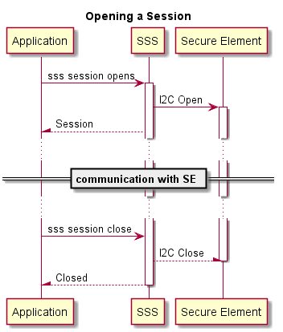

..
    Copyright 2019 NXP

    This software is owned or controlled by NXP and may only be used
    strictly in accordance with the applicable license terms.  By expressly
    accepting such terms or by downloading, installing, activating and/or
    otherwise using the software, you are agreeing that you have read, and
    that you agree to comply with and are bound by, such license terms.  If
    you do not agree to be bound by the applicable license terms, then you
    may not retain, install, activate or otherwise use the software.

======================================================================
 Session
======================================================================

See :cpp:func:`sss_session_open()`, :cpp:func:`sss_session_close()`

Opening a Session
======================================================================

Sessions are tightly coupled with underlying system.  For opening a session,
:cpp:func:`sss_session_open()`, subsystem is passed from
:cpp:type:`sss_type_t`, while the parameter :samp:`connectionData` plays a
pivotal role where there are subsystem specific parameters to be handled.

.. note::
  sss_session_open() must not be called concurrently from multiple threads.
  The application must ensure this.

SE05x Session
^^^^^^^^^^^^^^^^^^^^^^^^^^^^^^^^^^^^^^^^^^^^^^^^^^^^^^^^^^^^^^^^^^^^^^

For example, a dedicated :cpp:type:`SE_Connect_Ctx_t` is passed while opening
a session to the SE05x Secure Element.

.. literalinclude:: /tst/session_api/test_session_api_se.c
   :language: c
   :dedent: 4
   :start-after: /* doc:start SESession_Password */
   :end-before: /* doc:end SESession_Password */

APIS
======================================================================

See :ref:`api-ref-sss_session`
